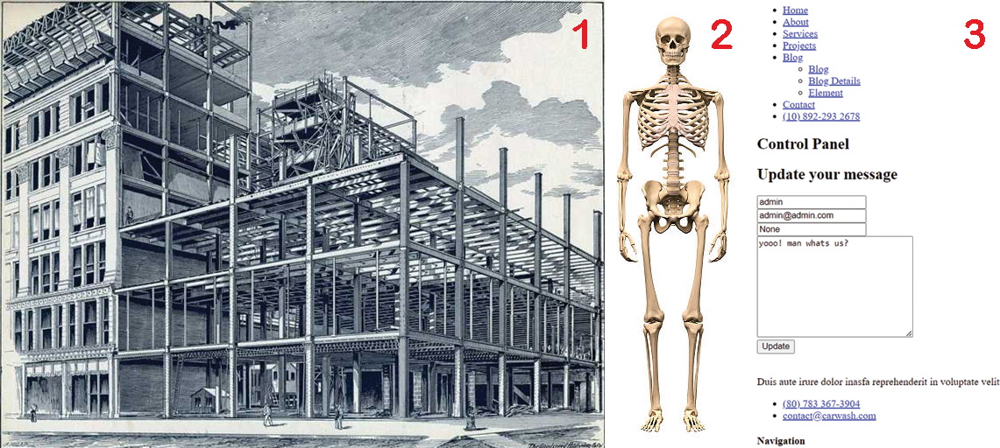
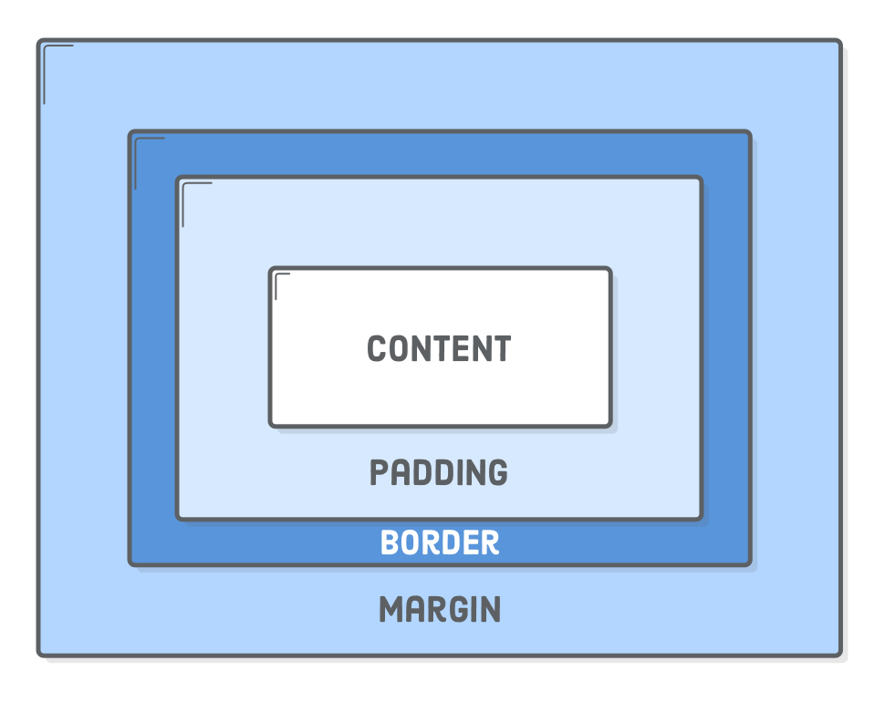

# Introducción al Desarrollo Web

## 📑 Resumen del Curso

Este curso de algo más de 1 hora está diseñado específicamente para introducir a chicos y chicas al apasionante mundo de la creación de sitios web. Con un enfoque 100% práctico, intuitivo y lúdico, los estudiantes aprenderán las bases fundamentales de **HTML**, **CSS** y una introducción conceptual a **JavaScript** sin enfrentarse a tecnicismos aburridos.

**¡Lo mejor de todo es que no requiere descargas ni configuraciones complejas!** Todo el trabajo se realiza directamente desde el navegador web utilizando la plataforma en línea **CodePen.io**, lo que garantiza que cualquier estudiante con acceso a internet pueda comenzar a programar al instante.

- **Duración total**: ~64 minutos de contenido audiovisual especializado.
- **Público objetivo**: Estudiantes de secundaria sin ninguna experiencia previa en programación o desarrollo de software.
- **Prerrequisitos**: Habilidad básica para usar un navegador web y teclado.
- **Herramientas necesarias**: ¡Solo un navegador web actualizado! (Google Chrome, Mozilla Firefox, Safari o Microsoft Edge) y acceso a internet para interactuar con [CodePen.io](https://codepen.io/).
- **📂 Repositorio Oficial de Código Fuente**: [https://github.com/kinetia-upc/webdev-course-kinetia](https://github.com/kinetia-upc/webdev-course-kinetia)
- **📹 Lista de reproducción en YouTube**: [https://www.youtube.com/playlist?list=PLvvnRKSsQU6qU1vRfhaQpXgkkRdaaQD2r](https://www.youtube.com/playlist?list=PLvvnRKSsQU6qU1vRfhaQpXgkkRdaaQD2r)

---

## 🗺️ Secuencia Dinámica de Lecciones

A continuación, se detalla la ruta de aprendizaje estructurada paso a paso. Cada lección está diseñada estratégicamente utilizando analogías cotidianas para facilitar la retención cognitiva en jóvenes estudiantes.

### Lección 1: ¿Cómo funciona internet y su relación con HTML?
- **Duración**: ~12 minutos
- **Temas Clave**: Introducción conceptual al ecosistema del desarrollo web, definición clara de un sitio web y la estructura HTML básica (etiquetas principales, elementos y atributos indispensables).
- **Enfoque Didáctico y Analogía**: En este video descubrirás qué pasa detrás de tus pantallas cuando navegas por internet y aprenderás a crear tus primeros códigos. Para entenderlo de forma muy fácil, imagina que una página web es como el cuerpo humano o la construcción de una casa: HTML es el esqueleto (los huesos rígidos que sostienen todo) o los planos estructurales de una vivienda. Te llevaré de la mano en la pantalla para construir tus primeros cimientos usando las etiquetas base (`<html>`, `<head>`, `<body>`), paso a paso, como si estuviéramos levantando las columnas y las paredes principales de tu propio hogar digital.
- **Enlace al Video**: [Ver Lección 1 en YouTube](https://youtu.be/E6tGKTL3XoA)

### Lección 2: Los bloques de construcción de la web
- **Duración**: ~13 minutos
- **Temas Clave**: Elementos HTML comunes y de uso cotidiano (encabezados de texto, párrafos, listas ordenadas e inactivas, incrustación de imágenes y enlaces hipertexto).
- **Enfoque Didáctico y Analogía**: Ahora que ya tienes listos tus cimientos, ¡es hora de darle vida a tu página! Siguiendo con nuestra analogía del esqueleto, en esta lección le agregaremos los "órganos" y los detalles visibles. Aprenderás a usar los encabezados (`<h1>` a `<h6>`), que funcionan exactamente igual que los grandes titulares de un periódico. También descubriremos cómo insertar tus fotos favoritas con la etiqueta `` y crearemos enlaces con `<a>`, que serán como puertas mágicas para transportarte instantáneamente a otras habitaciones del inmenso internet.
- **Enlace al Video**: [Ver Lección 2 en YouTube](https://youtu.be/vvZGX0kGNic)
- **Carpeta del código fuente**: [Construye tus Cimientos HTML](https://github.com/kinetia-upc/webdev-course-kinetia/tree/main/video-2-html)

### Lección 3: Pintando nuestra web: Introducción a CSS
- **Duración**: ~7 minutos
- **Temas Clave**: ¿Qué es CSS (Hojas de Estilo en Cascada)?, sintaxis de selectores, propiedades de personalización inicial (colores de texto, fondos y familias tipográficas).
- **Enfoque Didáctico y Analogía**: Si HTML es el esqueleto desnudo de nuestra web, ¡CSS es la ropa de diseñador, el peinado y el maquillaje! En este video aprenderás a tomar el control visual de tu página usando "selectores". Imagina que los selectores son etiquetas con los nombres de tus amigos en un salón de clases y tú tienes el poder de decirles: *"¡Tú, párrafo, píntate el cabello de azul!"* o *"¡Tú, título, cambia tu tamaño y ponte al centro!"*. Verás lo divertido y fácil que es transformar un sitio aburrido en uno lleno de color y estilo.
- **Enlace al Video**: [Ver Lección 3 en YouTube](https://youtu.be/4bKQeEmvdUo)
- **Carpeta del código fuente**: [Agrega Contenido a tu Web](https://github.com/kinetia-upc/webdev-course-kinetia/tree/main/video-3-css-principles)

### Lección 4: Diseñando con estilo: Bordes y alineación
- **Duración**: ~8 minutos
- **Temas Clave**: Maquetación y estilo visual simple, centrado absoluto de contenido, adición interactiva de colores de fondo avanzados y bordes decorativos.
- **Enfoque Didáctico y Analogía**: En esta lección desbloquearás un superpoder del diseño web: el **"Modelo de Caja"**. Te enseñaré de forma muy visual que absolutamente cada elemento en internet (un título, una foto o un botón) vive secretamente dentro de una caja invisible. Aprenderás a manipular estas cajas a tu antojo: descubrirás el truco definitivo para centrarlas perfectamente en la pantalla y cómo decorarlas poniéndoles bordes divertidos, fondos coloridos y espacios geniales para que tu diseño se vea súper profesional.
- **Enlace al Video**: [Ver Lección 4 en YouTube](https://youtu.be/49yBFyhyiFw)
- **Carpeta del código fuente**: [Dale Color a tu Código](https://github.com/kinetia-upc/webdev-course-kinetia/tree/main/video-4-css-designing)

### Lección 5: Proyecto Final: Tu primera página de perfil
- **Duración**: ~13 minutos
- **Temas Clave**: Integración total de conceptos de HTML y CSS, maquetación modular desde cero y despliegue del proyecto.
- **Enfoque Didáctico y Práctico**: Este video es **100% código en pantalla guiado**. Se estructurará e integrará desde una hoja completamente en blanco una biografía personal o portafolio interactivo. Verán cómo colocar su foto de perfil de manera circular, cómo escribir una descripción llamativa usando encabezados y párrafos, cómo centrar de forma impecable el contenedor completo y cómo aplicar una paleta de colores armónica. Al finalizar, tendrás en tus manos una página web real, atractiva y construida enteramente por ti mismo.
- **Enlace al Video**: [Ver Lección 5 en YouTube](https://youtu.be/cHEr1bbSsaY)
- **Carpeta del código fuente**: [Crea tu Perfil](https://github.com/kinetia-upc/webdev-course-kinetia/tree/main/video-5-project)

### Lección 6: Alertas de principiante: Errores comunes
- **Duración**: ~6 minutos
- **Temas Clave**: Recomendaciones profesionales de código limpio, buenas prácticas de nomenclatura y resolución activa de los errores más típicos de un programador junior.
- **Enfoque Didáctico y Práctico**: ¡No te preocupes, a todos los programadores del mundo nos pasa al principio! Este video está hecho para que no cometas los típicos errores que te harán perder la cabeza. Te enseñaré a ser un detective del código y resolveremos juntos esos misterios clásicos: ¿Por qué no carga mi imagen? (pistas sobre rutas mal escritas), ¿Por qué se rompió mi diseño? (el peligro de olvidar cerrar una etiqueta como `
`), o por qué la computadora se confunde al mezclar mayúsculas y minúsculas en tus archivos. Con estos consejos, programarás rápido y sin frustraciones.
- **Enlace al Video**: [Ver Lección 6 en YouTube](https://youtu.be/09HtUEN9-p8)
- **Carpeta del código fuente**: [Errores comunes](https://github.com/kinetia-upc/webdev-course-kinetia/tree/main/video-6-recomendations)

### Lección 7: El siguiente nivel: ¿Qué es JavaScript?
- **Duración**: ~5 minutos
- **Temas Clave**: Introducción puramente conceptual a JavaScript (JS) y el concepto de dinamismo e interactividad en la web moderna.
- **Enfoque Didáctico y Analogía**: Para cerrar con broche de oro nuestro gran viaje por el desarrollo web, te presentaré al tercer mosquetero del código: ¡JavaScript! Imagina que es el "sistema nervioso" o los músculos que le dan movimiento y reflejos al cuerpo de tu página. Haremos un repaso final de cómo trabajan en equipo: *HTML crea un botón simple, CSS lo pinta de un color verde genial, y JavaScript hace la magia de que, al hacerle clic, aparezca una alerta interactiva o el fondo de la pantalla cambie de color por completo.* ¡Es tu pase de entrada al siguiente nivel de la programación!
- **Enlace al Video**: [Ver Lección 7 en YouTube](https://youtu.be/VqVSZSkrKVY)
- **Carpeta del código fuente**: [Explora el Poder de JavaScript](https://github.com/kinetia-upc/webdev-course-kinetia/tree/main/video-7-javascript)

---

## 🚀 Nota Final

¡Felicidades por completar este circuito de aprendizaje! Para que sigas desarrollando tus superpoderes en el mundo web, te dejamos estos consejos de oro:

- **No te memorices el código:** Nadie se aprende todas las etiquetas o propiedades de memoria. Los mejores programadores del mundo todo el tiempo están buscando en Google o revisando documentación. Lo importante es que entiendas *para qué* sirve cada herramienta, no que te la sepas de memoria.
- **Aprende jugando con el "Fork" de CodePen:** La mejor forma de aprender es rompiendo cosas. Entra a los proyectos del curso, dale al botón de **Fork** (que crea una copia para ti) y empieza a cambiar los colores, a mover las cajas o a meter fotos raras. Si algo se rompe, ¡felicidades, estás aprendiendo!
- **La regla de oro de la consistencia:** Si un código no te funciona a la primera, respira hondo, conviértete en detective y revisa tres cosas: ¿Cerré todas las etiquetas? ¿Escribí todo en minúsculas? ¿Puse bien las rutas de mis imágenes? El 99% de los errores se solucionan con esos tres pasos.
- **Sigue construyendo:** Tu página de perfil es solo el inicio. Intenta replicar una página de tu videojuego favorito, una biblioteca para tus libros preferidos o un blog de notas para tus tareas. ¡La práctica hace al maestro!
